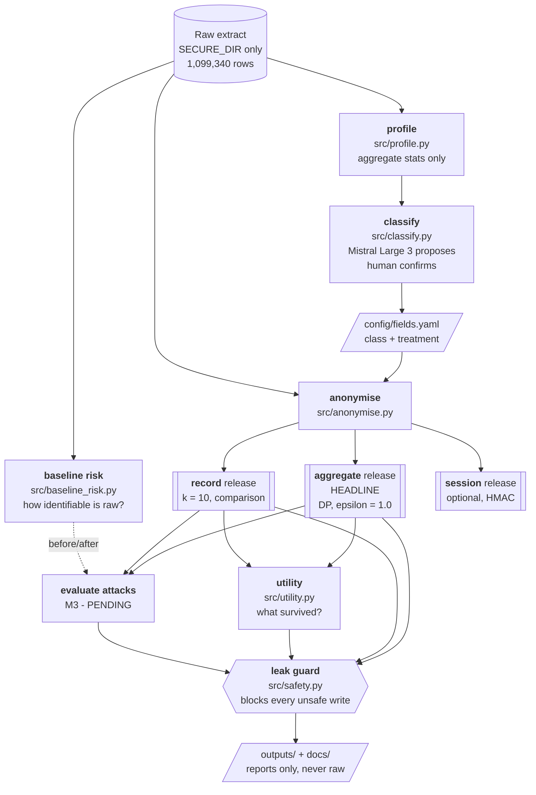

# Pitch guide — Elisa anonymisation challenge

A study guide for presenting and defending this solution. Written for an
engineer who is not a privacy specialist. Every number here comes from a file in
this repo; the source is named so you can check it under questioning.

**Status of M3.** The risk-evaluation milestone is not merged. Anywhere its
results belong, this guide says `[PENDING M3]` rather than guessing.

---

## 1. The problem

Elisa holds row-level mobile network performance data. Each row is one
subscriber's traffic, for one application category, in one cell, during one
10-minute window — and it carries three direct identifiers: `msisdn` (the phone
number), `imsi` (the SIM) and `imei` (the handset). Even with those removed, the
rows still say **where a person was and when**, which is enough to pick an
individual out of a crowd. Elisa's product teams want to use this data to find
where service quality is bad; they should not need to know who anyone is to do
that.

Elisa's ask, per `CLAUDE.md`, is explicitly **the method plus an honest account
of the residual risk** — not a claim of perfect anonymity. The brief adds one
hard rule: source identifiers must not appear in the final dataset, exported
artefacts, debug logs, screenshots or demo materials.

**On the law — be careful here.** This repo establishes only two legal framings,
both in the `Framing` section of `CLAUDE.md`:

- **Identifiability is relative** (the *EDPS v SRB* approach): risk is assessed
  against a *defined recipient*. Ours is an Elisa product team with no raw-data
  access and no auxiliary identity data. A claim that holds for that recipient
  does **not** hold for Elisa itself, which holds the source.
- **Anonymisation does not settle purpose limitation under ePrivacy.** Whether
  reuse is lawful is a separate question from whether re-identification is hard.

> The task brief for this guide mentioned GDPR and the Finnish Act 917/2014.
> **Neither appears anywhere in this repository.** Do not assert specific
> obligations under them in the pitch — you have no repo evidence to back it up,
> and a judge who knows the law will catch it. If asked, say: "we framed
> identifiability relatively, per EDPS v SRB, and we treat ePrivacy purpose
> limitation as an open question outside our scope." That is defensible.

---

## 2. The solution

We built a pipeline that profiles the data, gets every field classified by an
LLM and confirmed by a human, then publishes **three different releases** at
different points on the privacy/usefulness scale — an aggregate table with
differential privacy (the headline), a record-level table with k-anonymity (for
comparison), and an optional session-linked table. Everything is measured, not
asserted: we quantify the re-identification risk before anonymising, and we
quantify the utility lost afterwards. A **leak guard** stands between the
pipeline and every file it writes, so nothing containing a real identifier can
reach disk.



The guard is not a final step bolted on — it is invoked *inside* every write, so
a bad file never exists at its destination.

---

## 3. Repo walkthrough

### `src/`

| File | Lines | What it does |
| --- | --- | --- |
| `safety.py` | 643 | The chokepoint. Loads raw data, maintains the identifier registry, scrubs text, scans files, guards every write, and is the only route to the network. |
| `profile.py` | 264 | Reads raw, writes `outputs/profile.json`. Aggregates per column; identifier columns get shape only (lengths, digit share), never values. |
| `baseline_risk.py` | 283 | Reads raw, writes `outputs/baseline_risk.json`. Measures how identifiable the data is *before* anonymisation (R1 row uniqueness, R2 trajectories, R3 outliers). |
| `classify.py` | 382 | Reads `profile.json` + `docs/dataset_description.txt` only. Asks Mistral to classify all 23 fields, walks a human through each, writes `outputs/classification.json` and `config/fields.yaml`. |
| `anonymise.py` | 1,095 | Reads raw + both configs. Applies the transforms and writes the three releases, `transform_log.json`, `release_stats.json`, `sweep.json`, `docs/transformations.md`. |
| `utility.py` | 752 | Reads the releases + raw. Scores what survived; writes `outputs/utility_eval.json` and `docs/utility.md`. Does not modify the anonymiser. |

### `config/`

| File | What it holds |
| --- | --- |
| `fields.yaml` | Per field: the reviewed privacy `class` and the `treatment` actually applied. 23 entries. |
| `release.yaml` | The release parameters: `k: 10`, `time_bucket_minutes: 15`, `area_mode: enb_tokenised`, `dp_epsilon: 1.0`, thresholds and rounding. |

### `outputs/`

| File | Written by | Contains |
| --- | --- | --- |
| `profile.json` | `profile.py` | Column and structure aggregates. |
| `baseline_risk.json` | `baseline_risk.py` | The "before" risk numbers. |
| `classification.json` | `classify.py` | Proposed vs final class per field, reviewer, timestamps. |
| `transform_log.json` | `anonymise.py` | Every transform with its parameters and rows affected. |
| `release_stats.json` | `anonymise.py` | Per-mode suppression, escalation, group sizes, DP settings. |
| `sweep.json` | `anonymise.py` | 24 record-mode parameter combinations + 4 epsilon settings. |
| `utility_eval.json` | `utility.py` | U1–U5 scores. |
| `llm_calls.jsonl` | `safety.py` | Audit log of every LLM call. Git-ignored. |
| `releases/*.parquet` | `anonymise.py` | The actual released data. **Git-ignored — never committed.** |

### `docs/`

`dataset_description.txt` (one line per column, the LLM's only semantic input),
`transformations.md` and `utility.md` (both generated, never hand-edited),
`specs/m2.md` and `specs/m4.md`, and this guide.

### `tests/` — 80 tests

`test_safety.py` (29), `test_anonymise.py` (32), `test_utility.py` (19). All
build their own synthetic data with fabricated identifiers; none touches the
real extract.

### Run it end to end

```bash
python3.11 -m venv .venv
.venv/bin/pip install -r requirements.txt
cp .env.example .env          # then fill SECURE_DIR and the three LLM values

.venv/bin/python -m src.profile              # -> outputs/profile.json
.venv/bin/python -m src.baseline_risk        # -> outputs/baseline_risk.json
.venv/bin/python -m src.classify             # interactive field review
.venv/bin/python -m src.anonymise --mode all # aggregate + record releases
.venv/bin/python -m src.anonymise --mode session   # optional, explicit
.venv/bin/python -m src.anonymise --sweep    # -> outputs/sweep.json
.venv/bin/python -m src.utility              # -> outputs/utility_eval.json

.venv/bin/python -m pytest tests/            # 80 tests
.venv/bin/python -m src.safety guard --dir outputs   # must exit 0
.venv/bin/python -m src.safety wipe-tmp
```

---

## 4. Concepts explained

### Direct identifiers vs quasi-identifiers vs sensitive attributes

**Plain:** A *direct identifier* names someone on its own — a phone number. A
*quasi-identifier* doesn't, but combined with others it narrows down to one
person — where you were, at what time, on what network. A *sensitive attribute*
isn't identifying but is revealing if it gets attached to you.

**Example:** a number like "+358 40 123 45 67" is direct. "In Kainuu, at 16:15, on 5G" is three
quasi-identifiers that together might describe exactly one person. "Used
tethering" is sensitive — harmless until it's linked to you.

**Here:** `src/classify.py` puts all 23 fields into exactly one class;
`outputs/classification.json` records the result. **3 direct** (`msisdn`,
`imsi`, `imei`), **5 quasi** (`time_start`, `radio_access_type`, `province`,
`enb`, `tac`), **4 sensitive** (`im_video_GB_sum`, `im_audio_GB_sum`,
`tethering_data_GB_dl_sum`, `application_category`), **11 non-identifying**
(throughput, latency, retransmission and HTTP metrics).

**Why:** The class decides the treatment. Direct identifiers are dropped;
quasi-identifiers are generalised and k-checked; sensitive attributes are
top-coded.

**Weakness:** The boundary is a judgement call, not a fact. `data_GB_sum` was
classed non-identifying, yet our own baseline shows volume outliers are
distinctive (R3). Classification is a starting point, not a guarantee.

### Pseudonymisation vs anonymisation — and why hashing isn't anonymisation

**Plain:** Pseudonymisation swaps an identifier for a stand-in and the link
still exists. Anonymisation destroys the link. Hashing a phone number is
*pseudonymisation*: phone numbers come from a small, guessable space, so an
attacker hashes every candidate and matches.

**Example:** 10 million possible numbers, hash them all in seconds, compare.
Salting helps only while the salt stays secret; if the salt is stored, so is the
link.

**Here:** We proved this on our own code. An earlier version tokenised cells with
unsalted `md5(enb)[:8]`; brute-forcing the ~2,000 cell IDs recovered **1,914 of
1,914 (100%)**. After salting with an ephemeral per-run salt: **0 of 1,914**.
The current cell tokens in `anonymise.build_area` come from a seeded random
permutation whose map is held in memory and never written.

**Why:** Only the aggregate and record releases are proposed as anonymous
outputs. Any surviving key means pseudonymous, not anonymous.

**Weakness:** Cell tokens use seed 42 for reproducibility, so **anyone holding
both the raw extract and this code can rebuild the map**. That protects an
external recipient, not Elisa. Stated in `docs/transformations.md`.

### k-anonymity, counted on distinct subscribers

**Plain:** Every published combination of quasi-identifiers must describe at
least *k* different people. If a group has fewer, you can single someone out.

**Example:** With k=10, a group of "16:15, area A0042, 5G, Streaming" must
contain ≥10 distinct subscribers. Nine subscribers is too few — generalise or
drop it.

**The trap we avoided:** count *distinct subscribers*, not rows. One chatty
subscriber with 19 rows would satisfy "k=10 rows" alone while being completely
exposed. `anonymise.enforce_k_anonymity` uses `nunique` on the subscriber key,
and `tests/test_anonymise.py::test_k_counts_distinct_subscribers_not_rows`
asserts that 10 rows from 1 subscriber are all suppressed.

**Here:** QI set is `[time_bucket, area, radio_access_type,
application_category]`. Result: **min 10 distinct subscribers per group**, median
79, across 27,291 groups.

**Weakness:** k-anonymity says nothing about what's *inside* a group. If all 10
subscribers in a group used tethering, you learn that about all of them without
identifying anyone — that's the l-diversity gap below.

### Generalisation, tokenisation, suppression, primary vs secondary suppression

**Plain:**
- **Generalisation** — make a value less precise (16:17 → the 16:15 bucket; a
  specific cell → its province).
- **Tokenisation** — replace a value with a meaningless label (cell `12345678` →
  `A0042`), keeping "same/different" without the real ID.
- **Suppression** — delete what can't be made safe.
- **Secondary suppression** — after deleting one thing, delete another so the
  first can't be worked out by subtraction.

**Example:** A slice publishes cells of 40, 25 and 12 subscribers, and a fourth
cell of 6 is suppressed for being too small. If you know the slice holds 83
people, 83 − 40 − 25 − 12 = 6. You've recovered it. So we also suppress the
smallest survivor (12), leaving two unknowns and one equation.

**Here:** `anonymise.aggregate_cells`. Primary suppression removed **1,033**
cells below 10 subscribers; secondary removed **78** more. Total 1,111 of 3,753
cells = **29.6%**. We also publish **one granularity only** — no marginals or
totals file — which is what makes the subtraction attack need outside knowledge
in the first place.

**Why:** Generalise first, suppress last: suppression costs data, so it is the
fallback. The record release escalates area → province *before* dropping
anything, which is why only 0.32% of rows are lost while 33.6% are coarsened.

**Weakness:** Threshold rules always cost the thin strata most — see the 2G and
rural coverage numbers in §8.

### Winsorising and top-coding (and why we don't support means)

**Plain:** Both squash extreme values. *Winsorising* clips both ends to a
percentile; *top-coding* caps the top only. Extremes identify people — the
person using 250 GB in an hour is findable by that fact alone.

**Example:** Values 1, 2, 3, 4, 500. Top-code at the 99th percentile and 500
becomes ~4. Median is unchanged (3). **Mean falls from 102 to 2.8.**

**Here:** `anonymise.winsorise_qoe` clips QoE metrics at [0.01, 0.99];
`anonymise.top_code_volumes` caps volumes at p99; everything rounds to 3
significant figures.

**This is the biggest utility cost in the project, and M4 caught it.** Mean
shifts measured in `outputs/utility_eval.json`:

| Metric | Mean change | Note |
| --- | --- | --- |
| `im_video_GB_sum` | **−100%** | 99.7% of values are zero, so p99 is 0 — the cap flattens the column to all zeros |
| `im_audio_GB_sum` | −98.6% | 98.9% zeros |
| `http_response_time_avg` | −98.0% | 94.4% zeros |
| `tethering_data_GB_dl_sum` | −88.8% | 84.2% zeros |
| `data_GB_sum` | −53.8% | heavily skewed |
| `tp_dl_avg` | −26.0% | heavily skewed |

**Say this out loud in the pitch:** *medians survive, means do not.* The release
supports "what is typical" questions and must not be used for totals or averages
on those six metrics. On a column that is mostly zeros, a p99 cap sits at zero
and destroys it.

**Fix status:** identified by M4, **not yet fixed** — `src/anonymise.py` belongs
to M3 in parallel. The known fix is to take the quantile over non-zero values
only, which earlier code did. `[PENDING M3]`

### Trajectory uniqueness — the "4 points" result

**Plain:** Where you go is a fingerprint. Knowing a few places-and-times someone
visited is usually enough to find their one matching record.

**Example:** Thousands of people pass through the city-centre cell at 16:00.
Far fewer also appear in a suburb at 16:20, fewer still in a third cell at
16:40. By the fourth, it's almost always one person.

**Here:** `src/baseline_risk.py` R2, on **raw** data. A "point" is (cell, hour):

| Points known | Subscribers uniquely identified |
| --- | --- |
| 1 | 0.0% |
| 2 | 12.7% |
| 3 | 85.8% |
| **4** | **99.6%** |

Sampled 1,000 subscribers per level at seed 42, using an inverted index and set
intersection. Quote it as: *"among subscribers with at least 4 distinct cell
visits in the hour"* — that's 159,209 of 199,195 people.

**Why it matters:** this single number justifies the whole design. It's why the
headline release has no subscriber key, and why location is generalised to
province there.

**Weakness:** measured on one hour of fabricated data. With (province, date)
instead of (cell, hour), uniqueness is **0% at every level** — but only because
the extract is a single date, not because provinces are safe.

### l-diversity and homogeneity

**Plain:** k-anonymity hides *which* person you are. It doesn't hide *what is
true of all of them*. If everyone in your group shares a trait, the group's
anonymity doesn't protect that trait.

**Example:** A 10-person k-anonymous group where all 10 used tethering. You
can't tell which one is Anna, but if you know Anna is in that group, you've
learned she used tethering. l-diversity requires at least *l* distinct sensitive
values per group.

**Here:** Planned in M3 — the share of record-mode QI groups where every member
shares the same tethering flag or the same `application_category`.
**`[PENDING M3]`**

**Why:** It's the standard, well-known gap in a k-anonymity-only story, and a
judge may well ask. Knowing we measure it is better than claiming it can't
happen. Context: **58.25% of subscribers have some tethering** in raw, so
all-or-nothing groups are plausible.

**Weakness:** l-diversity has its own gaps (it ignores how skewed the attribute
is overall), which is part of why the headline release is aggregate + DP rather
than k-anonymity alone.

### Differential privacy

**Plain:** Add carefully calibrated random noise to published numbers so that
whether any one person is in the data barely changes the answer. Unlike
k-anonymity, it's a mathematical guarantee that doesn't depend on guessing what
an attacker knows.

- **Epsilon (ε)** — the privacy budget. Lower = more noise = more privacy.
- **Laplace noise** — the noise distribution, centred on zero, scaled by
  sensitivity ÷ ε.
- **Sensitivity** — how much one person can change the answer. For "count of
  distinct subscribers", one person changes it by 1.
- **Contribution bounding** — capping how much one person can affect a result, so
  sensitivity stays low.
- **Noisy-threshold suppression** — deciding what to publish using *noisy*
  counts, so the publish/suppress decision is itself covered.

**Example:** A cell truly has 50 subscribers. With ε=1 and sensitivity 1, the
noise scale is 1, so we publish about 50 ± 1. A user can't tell from 50 vs 51
whether they're in it. At ε=0.5 the scale doubles and noise roughly doubles.

**Here:** `anonymise.apply_dp_noise`. **Laplace, ε = 1.0, scale 1.0, seed 42**,
applied to `n_subscribers` and `n_rows`. Measured cost (`utility_eval.json` U4):
median relative error **0.28%**, p90 **5.3%**.

| ε | Noise scale | Median error | Mean error |
| --- | --- | --- | --- |
| 0.5 | 2.0 | 0.99% | 3.57% |
| **1.0** | **1.0** | **0.28%** | **1.77%** |
| 2.0 | 0.5 | 0.00% | 0.76% |
| none | — | 0 | 0 |

**What our DP does NOT cover — know these cold:**

1. **`n_rows` sensitivity is wrong.** One subscriber contributes up to 19 rows,
   so their true sensitivity is up to 19, not 1. We noise `n_rows` at scale 1
   anyway. **The ε=1.0 claim is therefore sound for `n_subscribers` and not a
   strict user-level guarantee for `n_rows`.** We did no contribution bounding.
2. **Suppression is decided on true counts**, not noisy ones. Which cells appear
   at all leaks information that ε does not cover. Proper noisy-threshold
   suppression would fix this.
3. **The QoE statistics are not noised at all** — only the two counts are. The
   medians, p10s and p90s are exact (post-generalisation).
4. **No budget composition.** We publish once. Repeated releases would consume
   more budget and we don't track that.

Both (1) and (2) are recorded in `release_stats.json` under `dp.caveats` — we
wrote them down rather than hoping nobody asks.

### Differencing attacks and membership inference

**Plain:** *Differencing* — compare two overlapping published figures and
subtract to isolate one person. *Membership inference* — work out whether a
specific person is in the dataset at all, which can itself be sensitive.

**Example (differencing):** "Average salary of 10 employees" and "average salary
of the same team excluding Bob" gives you Bob's salary exactly.

**Here:** Defended by publishing **one granularity only** plus secondary
suppression (78 extra cells). Membership inference is blunted by the Laplace
noise: if adding or removing one person barely moves the number, you can't tell.
Both need empirical testing in M3. **`[PENDING M3]`**

**Weakness:** the defence assumes we never publish a second, coarser table. If
anyone later publishes provincial totals from the same extract, the two together
reopen the attack.

### The Article 29 Working Party tests

**Plain:** Three questions a dataset must pass to count as anonymised:

| Test | Question | Our answer |
| --- | --- | --- |
| **Singling out** | Can you isolate one individual's record? | Aggregate release has no individual records at all. Record release enforces ≥10 distinct subscribers per group. Empirical test `[PENDING M3]` |
| **Linkability** | Can you link two records as the same person? | Aggregate: no key exists. Record: no key exists. Session: **yes by design**, within the release only. `[PENDING M3]` |
| **Inference** | Can you deduce an attribute with high confidence? | The weakest of the three for us — this is the l-diversity/homogeneity gap. `[PENDING M3]` |

**Why:** These three are the standard vocabulary a privacy-literate judge will
use. Answering in their terms shows you know the framework.

**Weakness:** passing all three is not a binary state; it depends on the assumed
attacker — which is the next concept.

### The relative approach (EDPS v SRB) and our threat model

**Plain:** "Is this anonymous?" has no universal answer. It depends on *who
holds it and what else they have*. The same file can be anonymous to one party
and identifying to another.

**Here (from `CLAUDE.md`):** our defined recipient is **an Elisa product team
with no raw-data access and no auxiliary identity data**. Our claims are scoped
to that recipient.

**Say this explicitly:** *"To Elisa itself, which holds the source extract and
the subscriber database, this data is not anonymous and we don't claim it is.
Our claim is about the defined recipient."* That's an honest answer and it's
also the correct legal framing under the relative approach.

**Weakness:** if the recipient definition is wrong — say the team does have
access to a marketing database with locations — the analysis has to be redone.

### HMAC with a destroyed key (session mode)

**Plain:** HMAC is a keyed hash: without the key you can't reproduce it, which
defeats the brute-force attack that beats plain hashing. We generate a random
key, use it once, then destroy it. Rows can be linked *within* the release and
never back to a person or across releases.

**Example:** Key is 32 random bytes. `HMAC(key, msisdn)` → `a1b2c3d4-e5f6a7b8`.
Same subscriber, same ID within the file. Once the key is gone, nobody —
including us — can reverse or reproduce it.

**Here:** `anonymise.add_session_id`. The key comes from `os.urandom(32)`, is
never written, logged or returned, and is overwritten in a `finally` block.
`tests/test_anonymise.py::test_session_ids_differ_between_runs` asserts two runs
produce different IDs, which proves the key really is ephemeral.

**Why:** It's the middle option — more useful than the record release, far safer
than a persistent pseudonym.

**Weakness:** **within-release linkage is still linkage.** With a session ID you
can rebuild a subscriber's set of cells, which is exactly the 4-point attack that
identifies 99.6% of people. This is why session mode is **optional and excluded
from the default `--mode all`**, and why the aggregate release is the headline.

> One small detail worth knowing: IDs are emitted as two 8-character groups
> (`a1b2c3d4-e5f6a7b8`). 16 unbroken hex characters are all digits often enough
> that the leak guard's "10+ digits" rule would fire on a few of 200,000. The
> separator avoids that without losing entropy.

---

## 5. Safety engineering

This is a differentiator. Most teams will anonymise data; fewer will have built
a machine that makes leaking structurally hard.

| Mechanism | What it does |
| --- | --- |
| **Identifier registry** | `load_raw` records every distinct `msisdn`/`imsi`/`imei` in an in-memory set — **597,585 values**. Never written, never printed. |
| **`scrub(text)`** | Replaces any registered value with `[REDACTED]`, then any remaining run of 10+ digits with `[DIGITS]`. |
| **`check_file` / `Finding`** | Scans CSV, Parquet, JSON, JSONL, Markdown, HTML, TXT, LOG, YAML and notebooks. A `Finding` records *where* a leak is — file, column or line — and **never the matched value**. |
| **`leak_guard`** | Scans a directory recursively, prints a summary, exits non-zero on any finding. Run before every commit. |
| **Safe writers** | `safe_write_json` / `_df` / `_text` stage into `$SECURE_DIR/tmp`, scan the staged file, and promote it only if clean. `safe_write_df` also refuses any frame with an identifier column outright. |
| **`@safe_main`** | Wraps every CLI so no exception message or traceback can print a raw value. |
| **`llm_gateway`** | The only network egress. Scans the prompt *and* system message **before the client object is even constructed**, so a leaky prompt can't reach the network layer. |
| **`SECURE_DIR`** | Raw data lives outside the repo. `load_raw` refuses any path outside it. `.gitignore` covers `.env`, `*.csv`, `*.parquet` and `outputs/releases/`. |

**It works, and we can prove it.** The guard has blocked real writes three times
during development — full-precision float tails in `profile.json` (89 findings),
an untransformed volume column in a release (172,938 findings), and an all-digit
hash format. Each was a genuine defect caught by the machine rather than by
review.

### What each AI saw

| | Saw | Never saw |
| --- | --- | --- |
| **Mistral Large 3**<br/>(in-pipeline, Verda-hosted in Finland) | Column names, the one-line field descriptions, and aggregate statistics from `profile.json` | Any row. Any identifier value. Any raw record. |
| **Claude Code**<br/>(coding assistant) | The code, configs, and aggregate outputs | The raw file — never opened, read or printed it |

Every Mistral call is logged to `outputs/llm_calls.jsonl` with timestamp,
purpose, model, endpoint host, prompt, response and a SHA-256 of the prompt.
**3 calls total**: one smoke test, two field classifications. The classification
prompt was ~10,400 characters of schema and statistics.

Mistral *proposed* the classification; a human reviewed all 23 fields and the
reviewer initials are recorded in `outputs/classification.json`. The AI did not
get the final say.

---

## 6. The numbers

### The data

| Figure | Value | Source | Meaning |
| --- | --- | --- | --- |
| Rows | 1,099,340 | `profile.json` | One hour of traffic |
| Subscribers | 199,195 | `profile.json` | Distinct `msisdn` |
| Rows per subscriber | min 1, median 5, max 19 | `profile.json` | Most people appear a handful of times |
| Time span | 2027-04-30 16:00–16:50 | `profile.json` | **Single hour, one date** |
| Cells (`enb`) | 1,983 | `profile.json` | 46 have <5 subscribers |
| Provinces / app categories | 20 / 25 | `profile.json` | Grouping dimensions |
| Access types | 4G 815,112 · 5G 280,992 · **2G 3,236** | `profile.json` | 2G is rare — remember this |
| Distinct `tac` | **1** | `profile.json` | Device model is constant; adds no risk *here* |

### Baseline risk — before anonymisation

| Figure | Value | Source | Meaning |
| --- | --- | --- | --- |
| QI set D: rows unique | 8.17% | `baseline_risk.json` | 1 in 12 rows is alone in its group |
| QI set D: subscribers exposed | **36.31%** | `baseline_risk.json` | Over a third own ≥1 unique row |
| QI set A (time+cell): rows unique | 0.017% | `baseline_risk.json` | Time+cell alone is weaker than expected |
| Trajectory, 4 points | **99.6%** | `baseline_risk.json` | The headline risk number |
| Trajectory, 3 points | 85.8% | `baseline_risk.json` | Risk climbs steeply |
| Subscribers with tethering | 58.25% | `baseline_risk.json` | Relevant to l-diversity |
| Volume unique at 0.1 GB | 0.019% | `baseline_risk.json` | Low, but non-zero |

### Release stats — after anonymisation

| Figure | Value | Source | Meaning |
| --- | --- | --- | --- |
| **Aggregate** cells published | 2,642 of 3,753 | `release_stats.json` | The headline release |
| Cells suppressed | 1,033 primary + 78 secondary = **29.6%** | `release_stats.json` | The cost of the threshold |
| Min / median subscribers per cell | 10 / 94 | `release_stats.json` | No thin cells survive |
| DP setting | Laplace, **ε = 1.0**, scale 1.0, seed 42 | `release_stats.json` | On the two count columns |
| **Record** rows published | 1,095,807 of 1,099,340 | `release_stats.json` | Comparison release |
| Rows suppressed / escalated | **0.32%** / 33.61% | `release_stats.json` | Generalise first, drop last |
| Min / median subscribers per QI group | 10 / 79 | `release_stats.json` | k=10 holds |
| QI groups | 27,291 | `release_stats.json` | |

### Parameter sweep

| Figure | Value | Source | Meaning |
| --- | --- | --- | --- |
| Record combinations tested | 24 | `sweep.json` | bucket × area mode × k |
| Worst suppression across all 24 | **1.22%** | `sweep.json` | Every combination is under 5% |
| Deployed setting | 0.32% suppressed | `sweep.json` | 15 min, tokenised, k=10 |
| ε sweep, mean count error | 3.57% / 1.77% / 0.76% at ε 0.5/1/2 | `sweep.json` | The privacy-utility curve |

### Utility — M4

| Figure | Value | Source | Meaning |
| --- | --- | --- | --- |
| **Headline: median `tp_dl_avg` within 5% of raw** | **99.92% of cells (target ≥90%) — PASS** | `utility_eval.json` | The number to lead with |
| Other U1 metrics | 96.8%–100% | `utility_eval.json` | All five pass |
| U2 coverage: rows / subscribers | 99.60% / 99.995% | `utility_eval.json` | Almost everyone is represented |
| U2 coverage: **2G** | **81.58%** of rows | `utility_eval.json` | vs 99.77% for 4G — uneven |
| U2 coverage: worst province | 48.19% ("Unavailable") | `utility_eval.json` | Next worst 93.99% |
| U3 province ranking | Spearman **0.997** | `utility_eval.json` | The ranking survives |
| U3 worst-10 cells | **10/10 overlap**, Jaccard 1.0 | `utility_eval.json` | The product question is answerable |
| U4 count error at ε=1 | median 0.28%, p90 5.3% | `utility_eval.json` | DP is cheap here |
| U5 severely degraded metrics | **6** | `utility_eval.json` | The top-coding problem |

### M3 attacks

| Figure | Value |
| --- | --- |
| Singling out / linkability / inference | `[PENDING M3]` |
| l-diversity, homogeneous groups | `[PENDING M3]` |
| Differencing recovery rate | `[PENDING M3]` |
| Membership inference at ε=1.0 | `[PENDING M3]` |

---

## 7. Decisions and trade-offs

**Why the aggregate release is the headline.** The baseline says 4 known cell
visits identify 99.6% of people. Any release keeping per-subscriber rows *and*
fine location keeps that attack alive. The aggregate release has no subscriber
key at all, generalises location to province, and adds calibrated noise — it
removes the attack rather than making it harder. It still answers the product
question: provinces rank at Spearman 0.997 and the worst-10 cells match 10/10.

**Why k=10.** The sweep shows the choice is nearly free: across all 24
combinations the worst suppression is 1.22%, and our setting costs 0.32%. Going
from k=5 to k=10 roughly doubles suppression but both are far under the 5%
budget, so we took the stronger setting. k=10 also matches the aggregate cell
threshold, so both releases tell the same story.

**Why ε=1.0.** ε=1 is a widely used default, and the measured cost is small:
median count error 0.28%, mean 1.77%. ε=2 would halve the noise but at ε=2 more
than half the cells get *zero* effective noise after rounding — the guarantee
becomes largely nominal. ε=0.5 doubles the error to 3.6% mean for a modest gain.
ε=1 sits where the curve bends.

**Why record mode is kept only as a comparison.** It's useful for showing what
k-anonymity alone buys and for analyses needing row-level detail with a tokenised
area. But it retains fine-grained location and 1.1M rows, so it's the riskier
artefact. It is published beside the headline, never instead of it.

**Why session mode is optional.** A session ID re-enables exactly the trajectory
attack the design exists to prevent. It's built, tested and available — but you
must ask for it explicitly, and `--mode all` won't produce it.

**Generalise before suppressing.** Escalating area → province rescues 369,536
rows (33.6%) that would otherwise have been deleted. Suppression is the last
resort, not the first tool.

### With more time

1. **Fix the top-coding collapse** — take the quantile over non-zero values,
   restoring the six degraded metrics. Known fix, identified, not yet applied.
2. **Hierarchical fallback for thin cells** — instead of suppressing outright,
   roll a thin cell up a location hierarchy (cell → municipality → province →
   national) until it reaches k. Would cut the 29.6% cell loss and reduce the
   2G/rural penalty.
3. **Contribution bounding + noisy-threshold suppression** — cap rows per
   subscriber so `n_rows` sensitivity is honest, and decide suppression on noisy
   counts so the published cell set falls inside ε.
4. **Finish M3** and put real attack numbers beside the design claims.
5. **Validate on real, multi-day data** — everything here is one fabricated hour.

---

## 8. Known limitations

State these before a judge finds them. Each is already recorded in the repo.

1. **One hour of fabricated data.** 2027-04-30, 16:00–16:50. No multi-day
   linkage exists, so longitudinal risk is **untested, not absent**. Real data
   would behave differently.
2. **`tac` is constant** across all 199,195 subscribers. Device-model risk reads
   as zero because the fabricated data has one device, not because we solved it.
3. **Suppression is uneven.** 2G keeps 81.58% of rows against 99.77% for 4G. The
   worst province keeps 48.19%. The people in thin strata — rural areas, old
   handsets — are the ones the data can say least about. This is the known
   weakness of every threshold method, and it has a fairness dimension worth
   naming.
4. **DP scope is narrower than "ε=1.0" suggests.** It covers `n_subscribers`
   properly; `n_rows` is under-noised for its true sensitivity; suppression is
   decided on true counts; the QoE statistics carry no noise at all.
5. **Top-coding destroys six metrics' means** — `im_video_GB_sum` entirely.
   Found by M4, fix known, **not yet applied** (`[PENDING M3]`). Until then the
   release answers "what is typical", never "how much in total".
6. **Cell tokens are reproducible** from raw data + this code (seed 42), so
   tokenisation protects an external recipient, not Elisa.
7. **Utility is measured on surviving cells only.** "99.92% accurate" describes
   the 70.4% of cells that were published. Accuracy and coverage must be quoted
   together.
8. **ePrivacy purpose limitation is unresolved.** Whether Elisa may reuse this
   data for a given purpose is a separate legal question we have not answered.
9. **No formal privacy budget accounting.** We publish once; repeated releases
   would need composition tracking.

---

## 9. Likely judge questions

**1. "Is this data anonymous?"**
Not unconditionally, and we won't claim that. It's anonymous *relative to a
defined recipient* — an Elisa product team with no raw access and no auxiliary
identity data. To Elisa, which holds the source, it isn't, and we say so. We
report ε and empirical attack rates instead of a binary claim.

**2. "Why not just use synthetic data?"**
Synthetic data moves the problem rather than solving it: a generative model
trained on real records can memorise them, and you then need the same
re-identification tests on the output. It also breaks the link to real network
conditions Elisa needs for service-quality decisions. Our approach keeps real
measurements and bounds the risk explicitly.

**3. "Utility is 99.9% — did you actually add any noise?"**
Yes, and it's important to be precise. The 99.9% is about *QoE medians*, which
are not noised — the noise goes on the two count columns. At ε=1 counts carry
median error 0.28% and p90 5.3%. Medians look untouched because winsorising only
clips the outer 1% of each tail, and a median is robust to that. The honest
version: **the noise is real, on counts; the medians are accurate because
medians are hard to move.**

**4. "So what did you actually lose?"**
Three things. 29.6% of cells suppressed entirely. The means of six metrics,
`im_video_GB_sum` completely. And all individual-level analysis. We measured all
three rather than discovering them later.

**5. "What if an attacker knows someone's location?"**
That's exactly our headline risk: on raw data, 4 known cell-visits identify
99.6% of subscribers. The aggregate release defeats it — no subscriber key means
nothing to link visits to, and location is generalised to province. On the
record release this is a live risk and part of why it isn't the recommendation.

**6. "Could Elisa itself re-identify this?"**
Yes. Elisa holds the source extract, and the cell token map is reproducible from
raw data plus our code under seed 42. We state this as a limitation. Our claims
are scoped to a recipient without that access. Insider risk is a governance
control, not a mathematical one.

**7. "Why k=10 and ε=1 specifically?"**
Both from the sweep, not from intuition. k: all 24 combinations suppress under
5%, so we took the stronger setting because it was nearly free — 0.32% at k=10.
ε: at ε=2 more than half the cells get zero effective noise after rounding, so
the guarantee goes nominal; ε=0.5 doubles the error for modest gain. ε=1 is
where the curve bends, and it's a common default.

**8. "What did the AI actually do?"**
Mistral Large 3, hosted in Finland, proposed a privacy class for each of the 23
fields from *aggregate statistics and column descriptions only* — it never saw a
row. A human reviewed every field; initials and timestamps are in
`outputs/classification.json`. Claude Code wrote the pipeline and also never
opened the raw file. Both are logged: every LLM call is in
`outputs/llm_calls.jsonl` with a prompt hash.

**9. "How would this run on billions of rows?"**
The transforms are all group-bys and quantiles that map directly onto Spark or
SQL, so the logic ports. Three things need work: the trajectory attack uses an
in-memory inverted index and would need sampling or a distributed join; the leak
guard scans every unique value per column and would need to move to sampling
plus schema-level checks; and k/ε would need re-tuning, since thresholds behave
very differently at scale — bigger data usually means *less* suppression.

**10. "Why publish three releases instead of one?"**
To make the privacy/utility trade-off visible rather than asserted. The
aggregate release is the recommendation; the record release shows what
k-anonymity alone achieves; session mode shows what linkage costs. A single
release would hide the reasoning.

**11. "What's your biggest weakness?"**
The top-coding collapse. Six metrics lost their means, one entirely, and we
found it only because we built a utility evaluation that flagged on mean changes
rather than just percentiles. The fix is known and not yet applied. Second
biggest: DP scope is narrower than "ε=1.0" sounds.

**12. "How do you know nothing leaked?"**
An automated guard, not a promise. Every distinct identifier is held in memory
(597,585 values) and every file written outside the secure directory is scanned
against it before it reaches its destination. It runs before every commit and
exits non-zero on any finding. It has blocked three real writes during
development.

**13. "Isn't k-anonymity outdated?"**
On its own, yes — it's vulnerable to homogeneity and background-knowledge
attacks, which is precisely why it's not our headline. The recommendation is the
DP aggregate. k-anonymity is the comparison baseline and the safety net on the
record release.

**14. "What about l-diversity?"**
It's the right question and it's our known gap. k-anonymity hides which person
you are, not what's true of everyone in your group — and 58% of subscribers have
some tethering, so homogeneous groups are plausible. M3 measures it.
`[PENDING M3]`

**15. "Could someone reverse the cell tokens?"**
Not from the release alone — the map lives in memory and is never written. But
with the raw extract and our code, yes, because the permutation is seeded at 42
for reproducibility. That's a deliberate trade and it's documented. An external
recipient can't; Elisa can.

**16. "Why is 2G coverage so much worse?"**
Only 3,236 rows are 2G out of 1.1 million. Any threshold rule hits the rarest
groups hardest, so 2G keeps 81.6% of rows against 99.8% for 4G. It's a real
fairness issue: the technology used disproportionately in rural areas and by
older handsets is the one we can say least about. A hierarchical fallback would
reduce it.

**17. "What happens if you publish this data twice?"**
Repeated releases consume privacy budget and open differencing attacks across
versions. We publish one granularity, once, with no marginals — but we don't
track budget composition, and that's a gap if this became a recurring feed.

**18. "Is the median really enough for a product team?"**
For "where is quality worst", yes — and we tested it: province rankings hold at
Spearman 0.997 and the worst-10 cells match 10/10. For capacity planning, which
needs totals, no — and that's exactly what top-coding broke.

---

## 10. Cheat sheet

**The ten things to remember.**

1. **1,099,340 rows, 199,195 subscribers, one hour** — 2027-04-30, 16:00–16:50.
2. **4 known cell visits identify 99.6%** of subscribers in raw data. This is why
   the whole design exists.
3. **36% of subscribers** own at least one unique row under the strongest QI set.
4. **Headline: median download throughput within 5% of raw for 99.92% of
   published cells, target 90% — PASS.**
5. **k = 10 distinct subscribers** — not rows. One chatty subscriber never
   satisfies k alone.
6. **ε = 1.0, Laplace, scale 1.0** on counts. Median count error 0.28%.
7. **29.6% of aggregate cells suppressed** (1,033 primary + 78 secondary); the
   record release loses only 0.32% of rows because it generalises first.
8. **Coverage is uneven: 2G keeps 81.6% of rows vs 99.8% for 4G.** Name it before
   a judge does.
9. **Top-coding destroyed six metrics' means**, `im_video_GB_sum` entirely. Found
   by our own utility check; fix known, not yet applied.
10. **We never claim "fully anonymous."** Risk is relative to a defined
    recipient; Elisa itself can still re-identify.

**The one-sentence pitch.** *We turned an extract where four known locations
identify 99.6% of people into an aggregate release with differential privacy
that still answers "where is service quality worst" to within 5% on 99.9% of
published cells — and we measured, rather than assumed, everything we lost.*

**If you only defend one thing:** the honesty. We report attack rates and ε
instead of claiming anonymity, we found and published our own worst bug, and a
leak guard blocked three real mistakes during development.
